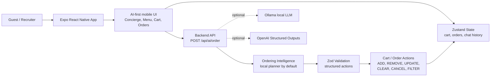

# Intelligent Bistro

A futuristic AI-powered restaurant ordering experience built for the Viridien AI Full-Stack Engineering Internship challenge.

The app combines a high-fidelity Expo React Native mobile interface with a Node.js backend that turns natural language ordering requests into structured, validated cart actions.

## Architecture



The default path is intentionally no-key and no-download: natural language is parsed by a local ordering planner, validated with Zod, and applied to the mobile state store as explicit actions. Optional model integrations are isolated behind the backend service layer.

## What this demonstrates

- Premium mobile UI and interaction design
- AI-first home screen with the manual menu behind a secondary toggle
- AI-driven outcome planning through structured JSON actions
- AI-only ordering jobs for menu narrowing, group planning, budget optimization, fastest pickup, and dietary scans
- In-chat item option cards so guests can choose surfaced recommendations without browsing the full menu
- Visible AI transaction trace: normalized intent, confidence, provider/model, impact metrics, cart diff, and JSON action preview
- Reliable cart state management through both UI and AI
- Placed-order cancellation through both the Orders screen and conversational AI
- Calories shown across menu cards, chat suggestions, cart rows, and receipts
- Loom demo reset for clean walkthroughs
- Structured JSON preview for every AI response
- Kitchen timeline and reorder flow for placed orders
- Backend schema validation with Zod
- No-key local AI planner by default, with optional Ollama open-source LLM or OpenAI Structured Outputs support
- Clean monorepo structure
- AI-assisted development workflow documented in `/prompts`

## Stack

### Mobile

- Expo React Native
- TypeScript
- Expo Router
- Zustand
- Expo Linear Gradient
- Expo Blur
- Lucide React Native

### Backend

- Node.js
- Express
- TypeScript
- Zod
- Offline local semantic order planner
- Optional Ollama local open-source LLM mode
- Optional OpenAI-compatible service layer

## Repo Structure

```txt
intelligent-bistro/
  apps/
    mobile/
      app/
      constants/
      services/
      store/
      types/
    backend/
      src/
        data/
        routes/
        schemas/
        services/
  prompts/
  docs/
  README.md
```

## Running Locally

Install root dependencies:

```bash
npm install
```

Run backend:

```bash
cd apps/backend
npm install
npm run dev
```

Run mobile app in another terminal:

```bash
cd apps/mobile
npm install
npx expo start
```

For iOS simulator, press `i`. For Android, press `a`. You can also scan the Expo QR code using Expo Go.

Run the polished web demo locally:

```bash
npm run dev:backend
npm run dev:web
```

Then open:

```txt
http://localhost:8081
```

## Submission Checklist

- `npm run typecheck`
- `npm run eval:ai`
- Loom walkthrough showing architecture, UI, AI-driven cart updates, checkout, cancellation, and code structure
- GitHub repository link submitted with the Loom URL

## AI Modes

The app works without any API key. By default the backend uses a local semantic order planner that returns the same structured JSON contract as an LLM. This keeps the take-home demo reliable for recruiters.

Create this file:

```bash
apps/backend/.env
```

No-key default:

```env
AI_PROVIDER=local
PORT=4000
```

Optional local open-source LLM mode with Ollama:

```env
AI_PROVIDER=ollama
OLLAMA_HOST=http://localhost:11434
OLLAMA_MODEL=llama3.2:1b
PORT=4000
```

Optional hosted model mode:

```env
AI_PROVIDER=openai
OPENAI_API_KEY=your_api_key_here
OPENAI_MODEL=gpt-4.1-mini
PORT=4000
```

Every mode validates responses with Zod before the cart changes. If an LLM is unavailable, the backend falls back to the local planner so the demo remains usable.

## Demo Commands

Try these in the AI assistant:

```txt
I want something light or healthy
```

The assistant scans the full menu, narrows the choice to two options, and asks one useful follow-up: light and fast, or healthy and filling.

```txt
healthy and filling
```

The assistant resolves the follow-up by adding the Pan-Seared Salmon and asking before adding a drink.

```txt
double it
```

```txt
make it no sauce
```

```txt
remove that
```

These demonstrate chat-based item editing against the current cart.

```txt
Build a group order for 4 people under $60 total, one vegetarian, no spicy items
```

The assistant compares the premium menu against the constraints, avoids spicy items, flags when a full entree order cannot honestly fit the budget, and asks before adding beverages.

```txt
clear the entire order
```

```txt
remove all the items
```

Both clear the cart through the same validated `CLEAR_CART` action.

```txt
I need something spicy and under 10 dollars
```

The assistant refuses to fake the match, explains that no spicy item fits, and surfaces the closest option as an in-chat card.

```txt
I need something spicy but under 20 dollars
```

The assistant adds the Spicy Chicken Sandwich, then asks whether the guest wants a drink instead of adding one automatically.

```txt
Optimize this cart to make it cheaper while keeping a complete meal
```

This demonstrates why the AI is more than a manual add button: it scans the current cart, removes optional extras, preserves the core meal, and returns a visible savings-oriented action plan.

```txt
Build the fastest pickup order
```

```txt
Run a dietary scan for safe options
```

```txt
Add two spicy chicken sandwiches and a large water
```

This is the core requirement demo. The assistant returns validated JSON actions and the UI shows the action trace, cart diff, and live order update.

```txt
Build the viral combo for two
```

```txt
Build me a high-protein lunch under $25
```

```txt
I want vegetarian and refreshing
```

```txt
Add fries and make my lemonade large
```

```txt
Remove the fries
```

```txt
Make the spicy chicken sandwich not spicy
```

```txt
Make everything less spicy
```

This demonstrates context-aware modification: the assistant reads the current cart and updates the existing spicy item instead of adding a duplicate.

```txt
Surprise me with the best order
```

```txt
Show me gluten-free options
```

```txt
Show me vegetarian options
```

```txt
Clear my cart
```

```txt
Add a burger
```

The last command demonstrates clarification handling.

```txt
Cancel my order
```

This demonstrates post-checkout order state management through the same structured AI action contract.

```txt
Build dinner for two under 900 calories each
```

This demonstrates multi-guest planning with calorie guardrails.

## AI-Assisted Development Workflow

I used AI coding tools as an engineering accelerator for scaffolding, iteration, and test generation, while keeping the architecture, schema boundaries, and product decisions explicit.

My prompting focused on:

- Defining the product requirements clearly
- Constraining the tech stack
- Requiring schema validation for AI output
- Separating frontend, backend, state, and AI parsing logic
- Prioritizing demo reliability through a no-key local AI planner
- Iterating on visual polish and user experience

Selected prompts used during development are included in `/prompts` to show how the work was planned and refined.

## Loom Walkthrough Suggested Flow

1. Show that the app opens directly into AI chat, with the manual menu available as a secondary toggle.
2. Tap “Reset Loom Demo” so the walkthrough starts clean.
3. Run: “Build dinner for two under 900 calories each.” Show calorie-aware planning and the AI decision card.
4. Expand “Structured JSON” and show validated cart actions.
5. Run: “remove sauce” or “pair a drink” to demonstrate chat-based item edits.
6. Approve the order and show receipt calories plus kitchen timeline.
7. Cancel the order from the Orders screen, then mention “Cancel my order” also works from chat.
8. Tap Reorder to Cart to show lifecycle polish.
9. Toggle to the menu briefly to show manual fallback, then return to AI.
10. Show backend code: route, parser, Zod schema, no-key local planner, optional Ollama path, and optional OpenAI Structured Outputs path.

## Engineering Notes

This project intentionally defaults to a local semantic order planner because internship demos should be reliable even when an external LLM key, rate limit, or network connection fails. If Ollama is available, the backend can call a local open-source model. If an OpenAI key is available, the backend can use Structured Outputs. In every mode, Zod validates the model/planner result before the frontend applies cart mutations.

Smoke test: clean change 1781719029
