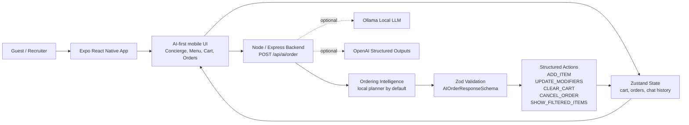

# Intelligent Bistro Architecture

## Request Flow

1. The guest sends a natural-language request from the AI Concierge screen.
2. The Expo app sends the message, current cart, and recent conversation to `POST /api/ai/order`.
3. The backend converts the request into structured actions with the no-key local planner by default.
4. The response is validated by Zod before the frontend applies any mutation.
5. Zustand applies cart/order changes and the UI renders the decision card, JSON preview, cart, receipt, and order timeline.

## Reliability Strategy

- The default experience requires no API key, no model download, and no network model dependency.
- Optional Ollama and OpenAI modes are isolated in the backend service layer.
- Every mode returns the same response shape, so the frontend is stable across providers.
- The backend eval suite covers core ordering, modification, clarification, cancellation, and calorie-planning flows.
